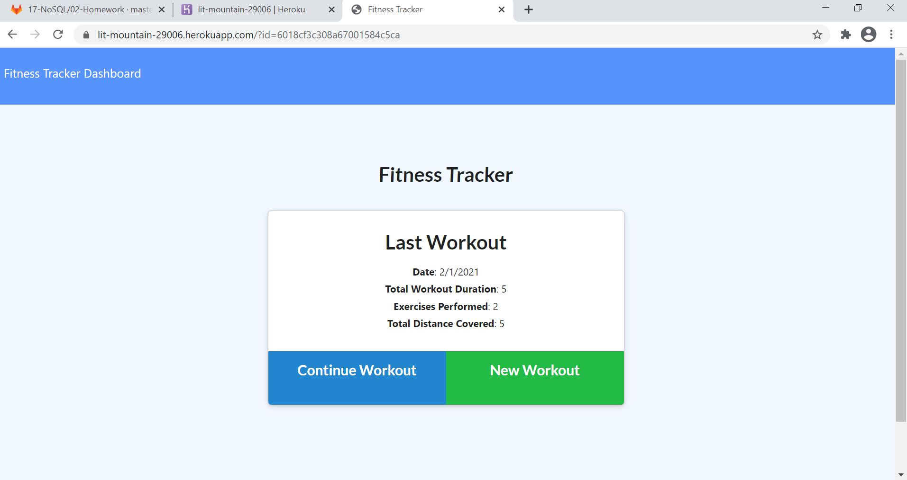
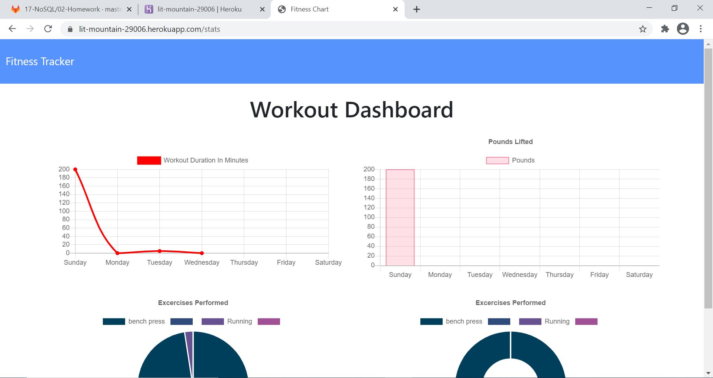

# workoutTracker

## Table of Contents
* [Description](#description)
* [Installation](#installation)
* [Usage](#usage)

## Description 
This application allows you to view, create, and track daily workouts. 
 
  
   
 

## Installation
You can view the application on Heroku: https://lit-mountain-29006.herokuapp.com/

1. git clone https://github.com/denisequarles1/workout
2. Run npm install
3. Run node server.js to run locally 
4. Run the seed.js if you would like to pre-populate the database. (seeders/seed.js)
 

## Usage 
You will be able to do the folling: 
1. Add exercises to a previous workout plan.
2. Add new exercises to a new workout plan.
3. View the combined weight of multiple exercises on the stats page.

